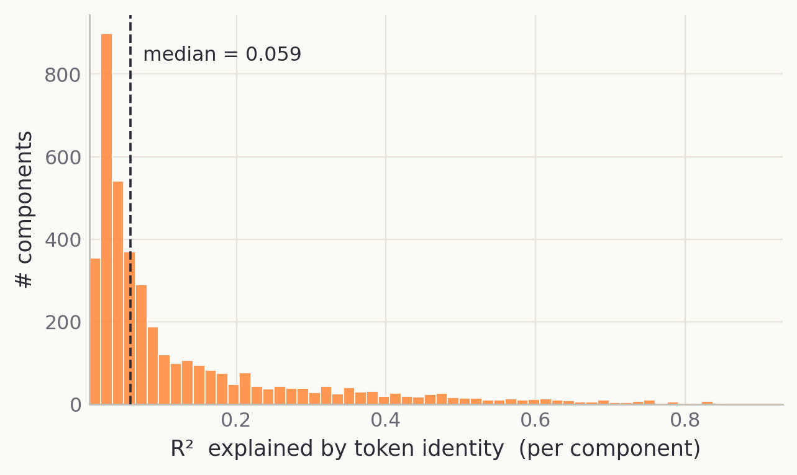
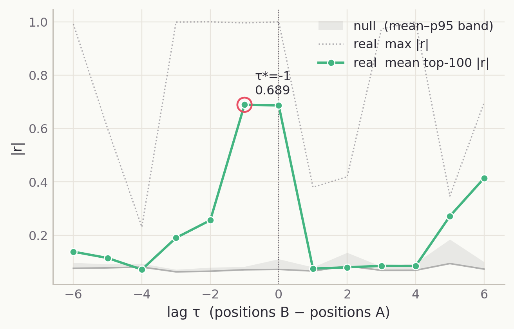
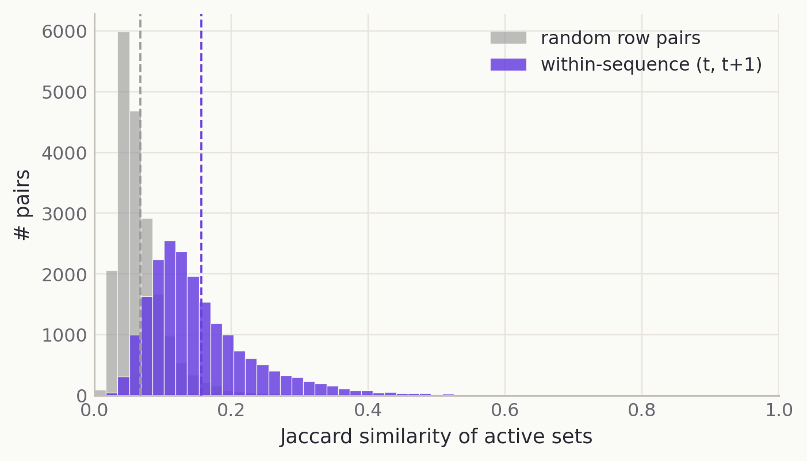

# The Gate Geometry of Parameter Decompositions

*VPD decomposes model weights into rank-one subcomponents. I looked
at the geometry of when those subcomponents are causally important.*

TL;DR:

- VPD ([Bushnaq et al., 2026](https://www.goodfire.ai/research/interpreting-lm-parameters))
  produces a causal-importance gate field $g^\ell_{b,t,c}\in[0,1]$. I
  treat that field as a geometric object on its own.
- The cosine co-importance kernel on the top-4,096 alive components
  has visible structure beyond a shuffled null, but the leading
  cosine eigenvalue is partly shared-base-rate alignment. Centered
  Pearson is the cleaner headline statistic.
- Token identity explains a modest slice (median per-component
  $R^2 = 0.06$, mean 0.13) with a clear lexical tail.
- Within-layer Q/K coupling is real and *narrow*: in three of four
  layers the mean-top-100 |r| peaks at $\tau = -1$ (the query gate
  at position $t$ couples with the key gate one position earlier).
  L2 peaks at $\tau = 0$.
- Past $\tau = \pm 2$, every layer collapses into the circular-shift
  null. The longer-range "Q reaches back several tokens" story from
  the v1 draft did not survive that null.
- Module geometries vary by roughly two orders of magnitude in
  effective rank within the same decomposition: L1 `attn.k_proj`
  lives in $\sim 5.5$ effective dimensions, L3 `mlp.down_proj` in
  $\sim 434$.
- The gate tensor is mostly token-local. At threshold $g > 0.5$, the
  median alive component has implied on-run length 1.06 tokens, and
  only 32 of 9,014 alive components have persistence > 0.8. Adjacent
  tokens share more support than random pairs (Jaccard 0.156 vs
  0.067), but almost every token still has a distinct active-set
  signature.


Code, data, and full numbers:
[github.com/aniket-desh/vpd-gate-geometry](https://github.com/aniket-desh/vpd-gate-geometry).
Authoritative results: [`docs/results.md`](https://github.com/aniket-desh/vpd-gate-geometry/blob/main/docs/results.md).

## Why look at gates?

VPD gives us two things. The first is the obvious one: a decomposition
of model weights into rank-one parameter subcomponents. The second is
easier to read as just an implementation detail: a causal-importance
field $g^\ell_{b,t,c}$, saying which subcomponents are needed on which
token positions. This post is about the second object.

[Goodfire's writeup](https://www.goodfire.ai/research/interpreting-lm-parameters)
says directly that VPD's current clustering uses same-position
correlations between causal importances, and that this is blind to
multi-sequence-position circuits. (Their canonical example: query and
key subcomponents in an induction-like head might be causally
important at different token positions.) That's a natural invitation
to look at the gate field itself as a data matrix, and to ask what
geometry it actually contains.

I do not run ablations, autointerp, or attribution graphs here. The
contribution is descriptive: same-position co-importance kernels,
token-identity residualization, lagged co-importance with null
controls, and per-(layer, module) geometry. The first version of this
project also taught me a methodological lesson about max statistics
that I think is worth writing down explicitly.

## VPD in the minimum necessary detail

The target is Goodfire's canonical 4-layer Llama-MLP-only transformer
trained on an uncopyrighted Pile subset. VPD decomposes 24 weight
matrices into 38,912 rank-one subcomponents. For each subcomponent it
learns a gate value $g^\ell_{b,t,c}\in[0,1]$, interpreted as how
necessary component $c$ is at token position $(b,t)$ in layer or
module $\ell$. The gate field is trained against a faithfulness
constraint using both stochastic and adversarially selected ablation
masks.

For this post, the important fact is that these gates form a
sparse-ish tensor that can be flattened into a matrix
$G \in \mathbb{R}^{N \times C}$, with token instances as rows and
parameter subcomponents as columns.

## The causal-importance field as a data object

In my main run, $N = 65{,}536$ token positions (16 batches × 8
sequences × 512 tokens, streamed from the canonical Pile dataset).
After restricting to alive components ($\bar g > 10^{-4}$) I work on
the top-4,096 alive subset ranked by mean activity.

The four probes:

1. **Same-position spectral structure.** Spectra of cosine, centered Pearson, and shuffled-null kernels on the top-4,096 alive matrix.
2. **Token-identity residualization.** Per-component $R^2$ against a per-token-id baseline.
3. **Lagged co-importance.** Pearson $r$ between top-K components of module $A$ at position $t$ and module $B$ at $t + \tau$, against a per-sequence circular-shift null on $B$.
4. **Per-(layer, module) spectra.** The same cosine kernel computed separately for each of the 24 decomposed matrices.

These are all proxies. They tell us how gate patterns relate, not
what the components do.

## Experiment 1: same-position gate geometry

I compare kernel variants on the top-4,096 alive components.

| variant | top eigenvalue | 10th | effective rank |
| --- | ---: | ---: | ---: |
| raw cosine | **206.1** | 38.5 | 940.7 |
| centered Pearson | **150.9** | 30.8 | 1{,}046.9 |
| token-residualized cosine | 143.1 | 30.6 | 1{,}292.6 |
| shuffled-cosine null | **150.4** | 1.51 | 3{,}417.9 |


(The lead figure at the top of this post shows the same kernel as a
heatmap pair: real on the left vs the column-wise row-shuffled null
on the right.)

The raw cosine top eigenvalue is 206. The same kernel on a
column-wise row-shuffled $G$ (each component column independently
re-shuffled along the row axis, preserving every per-component
marginal but destroying all cross-component co-activation) reports
150. The bare cosine $\lambda_1$ is therefore not evidence of
mechanism structure; it is mostly the global "mean direction" of
active components surviving shuffling. Centered Pearson removes that
mean direction and reports the same $\approx 150$, only without the
base-rate inflation.

What does matter is the *shape* of the spectrum. The shuffled null
collapses to a near-flat $\sim 1.51$ for indices 2 through $\sim 4000$;
real spectra drop smoothly over three decades. The first few hundred
modes sit above the null and the bulk tail sits below it, which is
the signature of a kernel that concentrates variance in the top few
hundred eigenvectors.

So the real claim is not "the raw cosine kernel has a huge top
eigenvalue"; it is "the centered gate kernel has a structured leading
spectrum above a shuffled null."

## Experiment 2: token identity is real, but not the whole story

How much of the top-4,096 gate matrix is explained by token identity
alone? I fit a per-token-id baseline (with shrinkage for rare tokens):
$g_{b,t,c} \approx \mu_c + a_{z(b,t),c}$, and look at per-component
$R^2$.



- Effective vocab with ≥ 16 occurrences: 522.
- Median per-component $R^2 = 0.059$; mean $R^2 = 0.129$.
- Top eigenvalue after token residualization: 143.1 (vs. raw cosine 206.1).

The histogram has a primary mode at $R^2 \le 0.10$ (contextual
components), a secondary mode at 0.15-0.30 (partially token-bound),
and a long tail past 0.7 that I read as the VPD-style "support"
population. But residualization barely moves the spectrum beyond
what centering alone already does: residualized $\lambda_1 = 143$
sits very close to Pearson's 151, so most of what token
residualization "removes" is the same mean alignment that centered
Pearson already removes.

Token identity is therefore a useful stratifier, not the main
explanation. It surfaces a lexical tail; most of the top-4,096 gate
geometry survives both centering and token residualization.

## Experiment 3: lagged co-importance and why max statistics fooled me

This is the experiment I got wrong the first time. The correction is
the most useful thing in the writeup.

For each pair of modules $(A, B)$ I compute the Pearson correlation
between top-384 components of $A$ at position $t$ and top-384
components of $B$ at $t + \tau$, for $\tau \in [-6, 6]$. That gives
a $384 \times 384$ correlation matrix per lag.

**The v1 mistake.** I summarized each lag's correlation matrix by its
**maximum absolute entry**. Across all four same-layer Q→K pairs the
max |r| peaked at $\tau \in \{-2, -3\}$, and I wrote down a story
about deeper layers reaching further back. With 147,456 component
pairs per lag, the maximum of the heavy tail saturates near 1.0 for
many lags, including ones whose bulk is indistinguishable from null.
Max |r| is fine for finding an illustrative pair; it is not a
summary statistic for whether one lag is heavier than another.

**The fix.** I switched to **mean of the top-100 |r|** per lag, and
added a per-sequence circular-shift null on module $B$ (six
independent shuffles per pair). The null preserves $B$'s
within-sequence marginal histogram and autocorrelation but breaks
every cross-module position alignment, so comparing real to null is
well-posed.


The corrected within-layer Q→K results:

| pair | τ at peak (mean top-100) | mean top-100 \|r\| | null p95 | excess |
| --- | :---: | ---: | ---: | ---: |
| L0 q → k | **−1** | 0.689 | 0.083 | **+0.607** |
| L1 q → k | **−1** | 0.393 | 0.046 | **+0.347** |
| L2 q → k |  **0** | 0.246 | 0.103 | +0.143 |
| L3 q → k | **−1** | 0.357 | 0.091 | **+0.265** |

Three of four layers peak at $\tau = -1$, not $\tau = 0$. That is
consistent with the reading that the query gate at destination
position $t$ couples maximally with the key gate one position
earlier; I want to call this "one-token-back Q/K gate coupling"
rather than "one-token-back attention," since we are still talking
about gate-field correlation, not attribution. L2 peaks at $\tau = 0$.



Past $\tau = \pm 2$ every same-layer Q→K pair drops into the null
band, and anything I previously read off the $\tau \in \{-3, -6\}$
end of the curve was the heavy tail talking, not real cross-position
coupling.

> Max |r| over hundreds of thousands of component pairs is an
> attractive nuisance. It is good for finding examples; it is not a
> summary statistic.

I'm writing this at length because it is a trap that is easy to walk
into for anyone analyzing VPD gates (or any high-dimensional
activation matrix) without an explicit null. The green line in the
figure above is the one I would actually defend.

## Experiment 4: per-(layer, module) geometry

This is the most robust descriptive result in the post; no
extreme-value statistic is involved.

For each of the 24 decomposed matrices I compute its own cosine
kernel on its alive components (capped at 1,024 per module, same
$\bar g > 10^{-4}$ threshold). The full table is in
[`docs/results.md`](https://github.com/aniket-desh/vpd-gate-geometry/blob/main/docs/results.md);
highlights:

| layer × module | alive | effective rank | participation ratio |
| --- | ---: | ---: | ---: |
| **L1 attn.k** | 46 | **5.5** | **2.8** |
| **L1 attn.q** | 10 | 7.0 | 5.4 |
| L1 attn.v | 209 | 39.5 | 8.6 |
| L2 attn.o | 522 | 320.7 | 146.4 |
| L2 attn.v | 481 | 245.6 | 96.7 |
| L0 mlp.down | 1,092 | 487.7 | 202.1 |
| L3 mlp.c_fc | 1,018 | 526.4 | 219.9 |
| **L3 mlp.down** | **1,837** | **433.8** | 103.7 |

L1 attention is the standout: 46 alive components in `attn.k_proj`
occupying 5.5 effective dimensions, only 10 alive in `attn.q_proj`
at 7.0 effective dimensions. The gate field assigns L1 attention a
tiny effective-dimensional budget. L3 `mlp.down` is the opposite
shape: a wide, redundant 1,837-component dictionary in $\sim 434$
effective dimensions.

The L1-to-L3 axis spans roughly two orders of magnitude in effective
rank within the same decomposition. Module geometries genuinely do
differ this much; that conclusion does not need null discipline.

## Experiment 5: the gate tensor is token-local

The kernel views hide two simple facts: most components do not
persist across many tokens, and exact active sets are almost never
reused.

**Temporal persistence.** For each alive component $c$, with binary
trace $b_t(c) = \mathbb{1}[g_{b,t,c} > 0.5]$, I compute
$P(b_{t+1} = 1 \mid b_t = 1)$.

| metric (over 9,014 alive components) | value |
| --- | ---: |
| median persistence  $P(\text{on at } t{+}1 \mid \text{on at } t)$ | 0.054 |
| mean persistence | 0.106 |
| mean baseline density  $P(\text{on})$ | 0.017 |
| median geometric on-run length | 1.06 tokens |
| 95th-percentile persistence | 0.409 |
| 95th-percentile on-run length | 1.69 tokens |
| components with persistence > 0.3 | 842 of 9,014  (9.3%) |
| components with persistence > 0.5 | 244 of 9,014  (2.7%) |
| components with persistence > 0.8 | **32 of 9,014  (0.4%)** |


Most alive components are short-lived. Mean persistence (0.106) is
about $6\times$ the mean baseline density (0.017), so it is not
literally "equal to baseline"; the gate field does carry a small
above-chance temporal correlation. But only **0.4% of alive
components have persistence > 0.8**, which is the threshold I would
need to call a component a real context-state variable.

**Row-pattern vocabulary.** Threshold $g > 0.5$ on the 9,014 alive
columns. Each token position becomes a binary active set $S_n$ of
average size 149.1.

| pair type | mean Jaccard | median | p95 |
| --- | ---: | ---: | ---: |
| random row pairs | 0.067 | 0.057 | 0.140 |
| within-sequence  $(t, t{+}1)$ | **0.156** | 0.134 | 0.322 |



Adjacent tokens share $2.3\times$ more support than random pairs but
still only $\sim 15.6\%$ of their active sets on average. The gate
field is locally smooth, but only modestly so. As a side observation:
65,211 of 65,536 token positions (99.5%) have a unique active set,
with the most common pattern covering only 11 rows. Exact uniqueness
is partly expected given the size of the combinatorial space
($9{,}014$ alive components, average support 149), so I treat the
Jaccard result as the headline and uniqueness as supporting evidence.

Together with the kernel views, this gives a coherent picture: VPD
gates carry real co-importance structure in the column dimension
(Experiments 1-4), but along the row dimension the decomposition
builds nearly token-specific active sets from short-lived atoms,
with a small persistent subspace ($\sim 32$ components) as the
exception. Any clustering method that only looks at same-token
co-activation will see the column geometry but will not surface the
persistent subspace, since those components are rare in any single
token.

## Summary: what survived the controls?

| claim | held up? |
| --- | --- |
| Raw cosine kernel has real spectral structure | Partly. Cosine $\lambda_1$ is half base-rate alignment; the leading $\sim 500$ centered-Pearson modes are above the shuffled null. |
| Token identity is the dominant geometric axis | No. Median $R^2 = 0.06$; lexical tail only. |
| Q/K coupling reaches back two or three tokens | No. Signal collapses into the null band past $\tau = \pm 2$. |
| Q/K coupling is one-token-back in most layers | Yes. Excess +0.27 to +0.61 over null p95 in L0/L1/L3; L2 peaks at $\tau = 0$. |
| Different modules have wildly different gate geometries | Yes. $\sim 80\times$ range in effective rank across modules. |
| Gate atoms are mostly persistent context variables | No. Mean persistence 0.11 vs mean baseline 0.02 (a real $\sim 6\times$ lift, but small in absolute terms); only 32 of 9,014 (0.4%) alive components reach persistence > 0.8. |
| Adjacent tokens use roughly the same active set | Partly. Adjacent-pair Jaccard 0.156 vs random 0.067 ($2.3\times$ lift), but adjacent tokens still differ on ~85% of their active components. |

## What this suggests for VPD-style clustering

Three clustering-relevant lessons seem worth taking seriously, with
the caveat that these are still descriptive proxies.

**Use centered Pearson, not raw cosine, as similarity.** A future
VPD-clustering pipeline that uses cosine on gates is reading off a
similarity whose leading direction is partly shared base rate.
Switching is essentially free and removes the inflation.

**Q/K offsets are local, not global.** The cross-position story for
within-layer Q/K is real but narrow: three of four layers couple at
$\tau = -1$, one at $\tau = 0$, nothing past $\tau = \pm 2$. A
clustering method that wants to group Q and K into the same
mechanism should use a small, fixed within-layer offset, not a
search over long-range lags.

**L1 attention is a good follow-up target.** The L1 attention
modules occupy $\sim 7$ effective dimensions, which is striking.
Either these alive components implement a small concentrated
behavior, or the decomposition has allocated a low-dimensional
residual subspace there. Autointerp labels on the L1 alive
components would distinguish these.

## Limitations

- Co-importance is not causal attribution. Components that fire on
  the same tokens may share a mechanism, but they may equally be
  triggered by the same lexical or syntactic feature, be redundant
  copies, or be upstream/downstream of each other.
- The kernel-level analyses live on the top-4,096 alive subset
  (ranked by mean activity), not all 38,912 atoms.
- The sample is 65,536 token positions from the Pile stream. That
  brings alive-counts within 10% of the paper's per-layer
  proportions, but it is not the full training distribution.
- The lagged null uses 6 circular-shift runs per pair. Enough to
  catch the v1 max-fishing error and to establish the $\tau = -1$
  signal in L0/L1/L3, not enough for a final p-value style analysis.
- No cluster ablations, no autointerp labels, no attribution graphs,
  no comparison to CLT/PLT
  ([Bussmann's `nn_decompositions@vpd_paper`](https://github.com/bartbussmann/nn_decompositions/tree/vpd_paper))
  or activation-space baselines.

## Future work

1. **Bilinear gate features.** Compute pairwise products
   $g_{b,t,c}\,g_{b,t,c'}$ and look for low-rank quadratic structure,
   in the spirit of bilinear autoencoders
   ([Dooms & Gauderis, 2025](https://arxiv.org/abs/2510.16820);
   [project page](https://tdooms.github.io/research/bae/)). The
   L0 Q→K coupling at $\tau = -1$ is exactly the kind of pairwise
   structure such a method could surface automatically.
2. **Persistent-component case study.** Autointerp the 32 alive
   components with persistence > 0.8 and the densest block from the
   cosine-kernel heatmap. These are two qualitatively different
   populations that the kernel and temporal views agree are worth
   inspecting.
3. **CLT/PLT comparison.** The Bussmann fork provides matched
   decompositions; the same spectrum, lag profile, and persistence
   distribution would tell us whether what we see is VPD-specific or
   generic to rank-one parameter decompositions.

## Reproducibility

| | |
| --- | --- |
| canonical run | `wandb:goodfire/spd/runs/s-55ea3f9b` |
| target model | `wandb:goodfire/spd/runs/t-9d2b8f02` |
| decomposition | 4-layer Llama-MLP-only, 24 matrices, 38,912 rank-one atoms |
| dataset | `danbraunai/pile-uncopyrighted-tok-shuffled` (streaming) |
| sample | 16 batches × 8 sequences × 512 tokens = 65,536 token positions |
| alive threshold | $\bar g > 10^{-4}$ |
| kernel subset | top-4,096 alive components by mean activity |
| lagged top-K | 512 (main run); 384 (Q/K sweep) |
| null | per-sequence circular shift of module $B$, 6 independent runs |
| hardware | single NVIDIA H200, 144 GB VRAM |

Full per-module table and per-pair lag profiles in
[`docs/results.md`](https://github.com/aniket-desh/vpd-gate-geometry/blob/main/docs/results.md)
and
[`outputs/gate_geometry/`](https://github.com/aniket-desh/vpd-gate-geometry/tree/main/outputs/gate_geometry).

<details>
<summary>Exact reproduction command</summary>

```bash
# Clone scaffold + upstream
git clone https://github.com/aniket-desh/vpd-gate-geometry.git
cd vpd-gate-geometry
git clone --depth 1 https://github.com/goodfire-ai/param-decomp.git external/param-decomp
cd external/param-decomp && uv sync && cd ../..

# Download canonical VPD model + target LM from public W&B GCS
# (the goodfire/spd project is USER_READ, no API key required;
# see docs/repo_readiness_report.md for the exact GraphQL queries).

# Run the main analysis with null controls
external/param-decomp/.venv/bin/python -m vpd_gate_geometry.run_analysis \
    --backend repo \
    --run-path runs/pile-4L/model_400000.pth \
    --target-model-path runs/pretrain-4L/files/model_step_99999.pt \
    --output-dir outputs/gate_geometry/pile4L_v2 \
    --cache-gate-matrix outputs/gate_geometry/cache/pile4L_16x8x512.pt \
    --n-batches 16 --batch-size 8 \
    --max-components 4096 --max-lag 6 \
    --lagged-top-k 512 \
    --alive-threshold 1e-4 \
    --n-null-runs 6 --null-kind circular \
    --device cuda
```
</details>

## Acknowledgments and citations

Goodfire's VPD paper is the central object this post depends on
(Bushnaq, Braun, Clive-Griffin, Bussmann, Hu, Ivanitskiy, Linsefors,
Sharkey, 2026:
[paper](https://www.goodfire.ai/research/interpreting-lm-parameters),
[code](https://github.com/goodfire-ai/param-decomp)). The framing of
parameter decomposition as the right object for mechanistic
interpretability comes from the SPD/APD lineage ([Bushnaq, Braun,
Sharkey, 2025](https://arxiv.org/abs/2506.20790)). The pairwise /
bilinear extension I gesture at in Future Work follows the bilinear
MLP and bilinear autoencoder line of work ([Pearce et al., 2025](https://arxiv.org/abs/2410.08417);
[Dooms & Gauderis, 2025](https://arxiv.org/abs/2510.16820)).

Thanks to whoever reads this and tells me what's wrong with it.

---

*Code: [github.com/aniket-desh/vpd-gate-geometry](https://github.com/aniket-desh/vpd-gate-geometry).
Tests: `pytest tests/test_smoke.py` covers the mock pipeline, null
preservation invariants, and the planted lagged-pair detection.*
